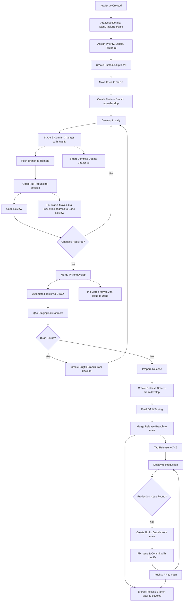

**full, detailed visual workflow diagram** for a **Jira + Git SDLC workflow** including everything: Jira issues, Git branches, commits, PRs, QA, release, hotfix, CI/CD, and deployment. I’ll structure it step by step in a **diagram-style format** that you can also turn into a visual chart.

---

# **Visual Workflow Diagram: Jira + Git SDLC**

# Engineering Workflow: Jira & Gitflow Integration

This repository follows a structured **Gitflow** branching model integrated with **Jira** automation. This ensures traceability from a task's inception to its production deployment.

---

## 🔄 Lifecycle Diagram

The following flowchart outlines the path of a feature, bugfix, or hotfix through our development pipeline.



---

## **Explanation of Diagram Nodes**

1. **Jira Phase**

   * Capture requirements
   * Subtasks for clarity
   * Issue assigned to developer

2. **Branching**

   * Feature branch: `feature/PROJ-123-description`
   * Bugfix: `bugfix/PROJ-456-description`
   * Hotfix: `hotfix/PROJ-999-critical-fix`

3. **Development**

   * Stage & commit with proper **type + Jira ID**:

     ```text
     feat(PROJ-123): add login page
     fix(PROJ-123): fix validation error
     ```
   * Push branch

4. **Pull Request & Code Review**

   * PR linked to Jira issue
   * Reviewers approve or request changes

5. **CI/CD & QA**

   * Automatic tests run on `develop`
   * QA tests in staging
   * Bugs → bugfix branch

6. **Release**

   * Create release branch: `release/v1.2.0`
   * Final QA → merge to `main`
   * Tag version → deploy to production
   * Merge back to `develop`

7. **Hotfix**

   * Emergency fix branch from `main`
   * Commit, PR → merge into `main` + `develop`

8. **Jira Smart Commits**

   * Commit messages auto-update Jira status
   * PR linked → status updates automatically

---

✅ This diagram **covers the full life cycle**: planning, branching, commits, PR, QA, release, hotfix, production deployment, and Jira integration.

---

Absolutely! Let’s dive deeper and make this a **full, detailed Jira + Git SDLC workflow** with all the steps, best practices, Git commands, Jira usage, commit strategies, CI/CD integration, and even tips for scaling teams. I’ll break it down step by step.

---

# 🛠 Detailed Jira + Git Software Development Lifecycle (SDLC) Workflow

---

## **1️⃣ Requirement / Planning Phase**

**Goal:** Capture what needs to be built and plan work.

**Steps:**

1. **Create Jira Issue**

   * Types: `Story`, `Task`, `Bug`, `Epic`, `Improvement`.
   * Include:

     * Title
     * Description
     * Acceptance criteria
     * Priority (`High`, `Medium`, `Low`)
     * Assignee
     * Labels (`frontend`, `backend`, `hotfix`)
   * Example:

     ```
     Jira ID: PROJ-123
     Title: Implement login page
     Description: Create login page with email/password authentication
     Acceptance Criteria:
       - User can login
       - Invalid login shows error
       - Works on mobile and desktop
     Labels: frontend
     Priority: High
     ```

2. **Create Subtasks (Optional)**

   * Break big stories into smaller tasks, e.g.:

     * UI design
     * Backend API integration
     * Validation & error handling

3. **Estimate Effort**

   * Story points or time estimates.

4. **Move Issue to “To Do”** in Jira workflow.

---

## **2️⃣ Branching Strategy (GitFlow)**

Use a **structured branching model**:

| Branch Type | Naming                  | Purpose                         |
| ----------- | ----------------------- | ------------------------------- |
| `main`      | main                    | Production-ready code           |
| `develop`   | develop                 | Integration branch for features |
| `feature`   | feature/<Jira-ID>-short | Work on a specific Jira story   |
| `bugfix`    | bugfix/<Jira-ID>-short  | Fix non-production bugs         |
| `hotfix`    | hotfix/<Jira-ID>-short  | Emergency production fixes      |
| `release`   | release/<version>       | Prepare production release      |

**Example Feature Branch:**

```
feature/PROJ-123-login-page
```

---

## **3️⃣ Development Phase**

### **Step 1: Pull latest code**

```bash
git checkout develop
git pull origin develop
```

### **Step 2: Create a feature branch**

```bash
git checkout -b feature/PROJ-123-login-page
```

### **Step 3: Develop**

* Write code
* Add tests
* Run locally

### **Step 4: Stage and Commit Changes**

**Commit rules:**

* Reference Jira issue
* Use conventional commit format:

```
<type>(<Jira-ID>): short description

Optional longer explanation
```

**Commit Types Example:**

| Type     | Example Commit                              |
| -------- | ------------------------------------------- |
| feat     | feat(PROJ-123): implement login page UI     |
| fix      | fix(PROJ-123): correct password validation  |
| chore    | chore(PROJ-123): update dependencies        |
| style    | style(PROJ-123): format code with Prettier  |
| refactor | refactor(PROJ-123): simplify login function |
| test     | test(PROJ-123): add login validation tests  |

**Commands:**

```bash
git add .
git commit -m "feat(PROJ-123): implement login page UI"
```

### **Step 5: Push branch**

```bash
git push -u origin feature/PROJ-123-login-page
```

---

## **4️⃣ Code Review & Pull Requests (PR)**

1. Open a **Pull Request** targeting `develop`
2. Include:

   * Jira ID in title: `[PROJ-123] Implement login page`
   * Description
   * Screenshots / demo link (if UI)
3. Reviewers:

   * Backend / frontend reviewer as required
4. PR Status → Linked in Jira issue
5. Fix issues in same branch if PR is not approved

**Commands for updating PR:**

```bash
git commit -am "fix(PROJ-123): adjust validation messages"
git push
```

---

## **5️⃣ Merge to Develop**

1. After PR approval: merge into `develop`
2. Delete branch locally and remotely

```bash
git branch -d feature/PROJ-123-login-page
git push origin --delete feature/PROJ-123-login-page
```

3. CI/CD runs automated tests on `develop`

---

## **6️⃣ Testing / QA Phase**

1. QA tests changes in `develop` or a **staging environment**
2. Issues found → bugfix branches
3. Example:

```bash
git checkout -b bugfix/PROJ-124-fix-login-error develop
```

* Fix bug, commit, push, PR → merge back to `develop`

---

## **7️⃣ Release Phase**

1. Create a **release branch** from `develop`

```bash
git checkout -b release/v1.2.0 develop
```

2. QA and testing
3. Version bump / changelog update
4. Merge release branch into `main`

```bash
git checkout main
git merge release/v1.2.0
git tag -a v1.2.0 -m "Release v1.2.0"
git push origin main --tags
```

5. Merge release back into `develop`

```bash
git checkout develop
git merge release/v1.2.0
```

---

## **8️⃣ Hotfix Workflow**

1. Create branch from `main` for critical bug:

```bash
git checkout main
git pull
git checkout -b hotfix/PROJ-999-critical-fix
```

2. Fix bug → commit → push → PR → merge into `main`
3. Merge hotfix into `develop` to keep code in sync

---

## **9️⃣ Jira Integration Tips**

* **Smart commits** update Jira automatically:

```bash
git commit -m "PROJ-123 #comment implemented login #time 3h #done"
```

* Move Jira issue automatically:

  * `In Progress` → branch created
  * `Code Review` → PR open
  * `Done` → PR merged

---

## **🔟 CI/CD Integration**

* Pull → Build → Test → Deploy to staging
* Merge release → Deploy to production
* Optional:

  * Unit tests
  * Linting
  * Code coverage

---

## **11️⃣ Git Commands Quick Reference for SDLC**

| Stage         | Command                                                                        |
| ------------- | ------------------------------------------------------------------------------ |
| Setup         | `git clone <repo>`                                                             |
| Start Feature | `git checkout -b feature/PROJ-123`                                             |
| Stage         | `git add .`                                                                    |
| Commit        | `git commit -m "feat(PROJ-123): message"`                                      |
| Push          | `git push -u origin feature/PROJ-123`                                          |
| PR            | Open Pull Request to `develop`                                                 |
| Merge         | `git checkout develop` → `git merge feature/PROJ-123`                          |
| Delete Branch | `git branch -d feature/PROJ-123` & `git push origin --delete feature/PROJ-123` |
| Hotfix        | `git checkout -b hotfix/PROJ-999 main`                                         |
| Release       | `git checkout -b release/v1.2.0 develop` → QA → merge into `main`              |

---

## **12️⃣ Best Practices**

* Use **small, logical commits**
* Reference **Jira issue IDs** in every commit
* Always **rebase** feature branches before merging:

```bash
git pull --rebase origin develop
```

* Keep `main` stable, `develop` as integration
* Use **feature flags** for unfinished features
* Use **code review** for quality assurance
* Stash uncommitted changes if switching branches:

```bash
git stash
```

---

✅ This workflow covers **everything from Jira issue creation → Git branching → PR → QA → Release → Hotfix → Production**, including **CI/CD, commit messages, and best practices**.


