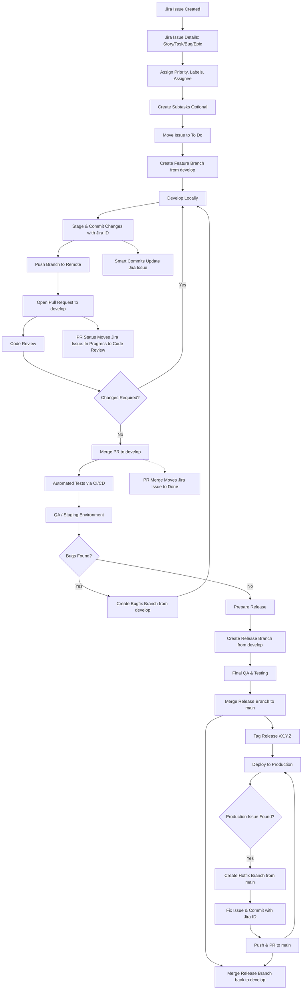

Perfect! Let’s make a **full, detailed visual workflow diagram** for a **Jira + Git SDLC workflow** including everything: Jira issues, Git branches, commits, PRs, QA, release, hotfix, CI/CD, and deployment. I’ll structure it step by step in a **diagram-style format** that you can also turn into a visual chart.

---

# **Visual Workflow Diagram: Jira + Git SDLC**

# Engineering Workflow: Jira & Gitflow Integration

This repository follows a structured **Gitflow** branching model integrated with **Jira** automation. This ensures traceability from a task's inception to its production deployment.

---

## 🔄 Lifecycle Diagram

The following flowchart outlines the path of a feature, bugfix, or hotfix through our development pipeline.



---

## **Explanation of Diagram Nodes**

1. **Jira Phase**

   * Capture requirements
   * Subtasks for clarity
   * Issue assigned to developer

2. **Branching**

   * Feature branch: `feature/PROJ-123-description`
   * Bugfix: `bugfix/PROJ-456-description`
   * Hotfix: `hotfix/PROJ-999-critical-fix`

3. **Development**

   * Stage & commit with proper **type + Jira ID**:

     ```text
     feat(PROJ-123): add login page
     fix(PROJ-123): fix validation error
     ```
   * Push branch

4. **Pull Request & Code Review**

   * PR linked to Jira issue
   * Reviewers approve or request changes

5. **CI/CD & QA**

   * Automatic tests run on `develop`
   * QA tests in staging
   * Bugs → bugfix branch

6. **Release**

   * Create release branch: `release/v1.2.0`
   * Final QA → merge to `main`
   * Tag version → deploy to production
   * Merge back to `develop`

7. **Hotfix**

   * Emergency fix branch from `main`
   * Commit, PR → merge into `main` + `develop`

8. **Jira Smart Commits**

   * Commit messages auto-update Jira status
   * PR linked → status updates automatically

---

✅ This diagram **covers the full life cycle**: planning, branching, commits, PR, QA, release, hotfix, production deployment, and Jira integration.

---

